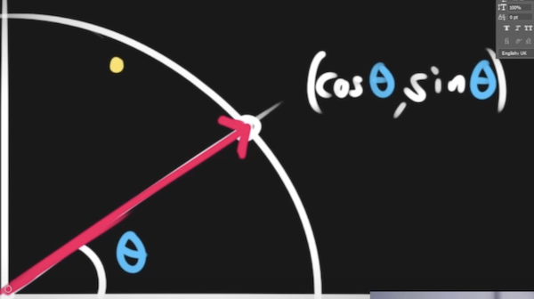

# Moving in a direction


Gebruik links,rechts om te sturen, en UP om de auto in die richting te bewegen.


```javascript
import { Actor, Vector, Input } from "excalibur";
import { Resources } from "./resources.js";

export class Car extends Actor {
  constructor() {
    super();
  }
  onInitialize(engine) {
    this.graphics.use(Resources.Car.toSprite());
    this.pos = new Vector(400, 400);
    this.vel = new Vector(0, 0);
  }

  onPreUpdate(engine) {
    let speed = 0;

    // UP = forward
    if (
      engine.input.keyboard.isHeld(Input.Keys.Up) ||
      engine.input.keyboard.isHeld(Input.Keys.Up)
    ) {
      speed = -150;
    }

    // cursor keys is direction
    if (
      engine.input.keyboard.isHeld(Input.Keys.D) ||
      engine.input.keyboard.isHeld(Input.Keys.Right)
    ) {
      this.rotation += 0.05;
    }
    if (
      engine.input.keyboard.isHeld(Input.Keys.A) ||
      engine.input.keyboard.isHeld(Input.Keys.Left)
    ) {
      this.rotation -= 0.05;
    }

    // direction is the cosine/sine of the angle!
    let direction = new Vector(
      Math.cos(this.rotation) * speed,
      Math.sin(this.rotation) * speed
    );

    this.vel = direction;
  }
}
```
Hieronder zie je hoe de rotation (θ, in radians) omgezet wordt naar een X,Y vector.


