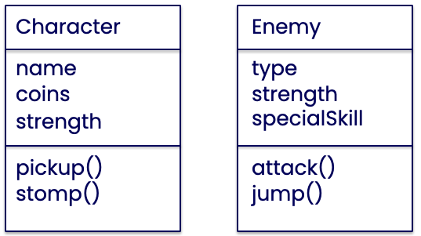

# Les 3 - week 2 ochtend

## Object Oriented Programming

- Klassendiagram tekenen
- Classes en instances in javascript

<Br>
<Br>
<Br>

## Opdracht Klassendiagram

Bekijk dit screenshot van ***new super mario bros***, of gebruik een screenshot van je eigen favoriete 2D game.

Noteer welke classes de game volgens jou kan bevatten in een klassendiagram. Noteer ook eigenschappen en gedrag.


Gebruik Miro, draw.io of een andere tool waarin je makkelijk een class diagram kan tekenen.


<Br>
<Br>
<Br>

## Opdracht Classes zonder Excalibur

- Fork en clone het [Startproject Javascript](https://github.com/HR-CMGT/prg4-javascript-2023) volgens de [install instructies](../setup.md)
- Hierin zit geen excalibur
- Schrijf onderstaande twee classes (of een aantal classes uit je eigen klassendiagram) in javascript.
- Elke class krijgt een eigen file. Gebruik het export keyword.
- Importeer de classes in main.js en maak een aantal instances van character en enemy.
- Geef de instances verschillende waarden, bijvoorbeeld name="mario" en name="luigi"
- Gebruik `console.log()` in de constructor en de functies om te zien of het werkt.

<br>



<Br>

VOORBEELDCODE

```javascript
export class DeLorean {
    speed
    time
    constructor() {
        this.speed = 0
        this.time = 0
    }
    timeTravel() {
        this.time++
    }
}
```
