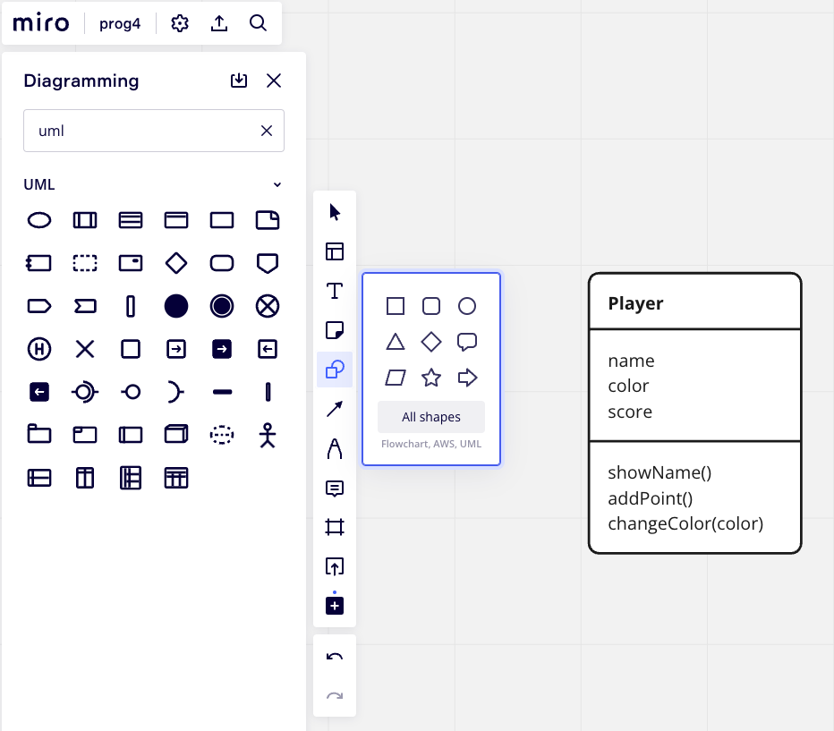
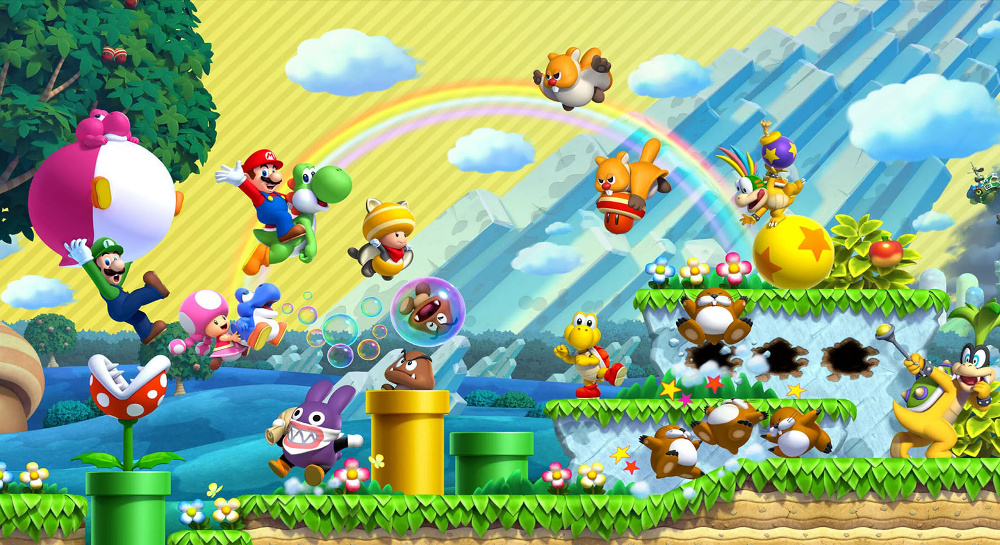

# Les 3 - week 2 ochtend


## Opdracht Classes zonder Excalibur

- Fork en clone het [Startproject Javascript](https://github.com/HR-CMGT/prg4-javascript-2023) volgens de [install instructies](../setup.md)
- Hierin zit geen excalibur
- Voer `npm install` uit en daarna `npm run build`.
- Schrijf onderstaande class in javascript.
- Elke class krijgt een eigen file. Gebruik het `export` keyword.
- Importeer de classes in main.js en maak een aantal instances van Player.
- Geef de instances verschillende waarden, bijvoorbeeld name="mario" en name="luigi"
- Gebruik `console.log()` in de constructor en de functies om te zien of het werkt.
- Toon de naam van de player in de console (via de functie `showName()`) en gebruik daarbij de kleur van de speler. 
  - Om de tekst in de console aan te passen kan je css gebruiken
  - ```javascript
    console.log("%c My name", "color: red; font-weight: bold; font-size: 20px");
    ```
- Geef (in de Main) een punt aan de speler en toon de score in de console.
- Verander de kleur van de speler (met de functie `changeColor(color)`) en toon nogmaals zijn naam. 

<br>


<Br>

VOORBEELDCODE

```javascript
export class DeLorean {
    speed
    time
    constructor() {
        this.speed = 0
        this.time = 0
    }
    timeTravel() {
        this.time++
    }
}
```
<Br>
<Br>
<Br>

## Object Oriented Programming

- Classes bedenken voor je eigen project
- Eigenschappen en gedrag bepalen van de classes

<Br>
<Br>

## Opdracht 

De eerste stap bij Objectgeoriënteerd programmeren is het bedenken van classes. Noteer voor je eigen 
game de classes die je nodig hebt. Vervolgens bepaal je per class de eigenschappen (variabelen) en het gedrag (functies).

Een handig hulpmiddel hierbij is het volgende stappenplan: 
1. Schrijf de regels van je spel uit en onderstreep de zelfstandige naamwoorden.
2. Bepaal welke zelfstandige naamwoorden een class kunnen zijn. Is het een zelfstandignaamwoord waarvoor je iets wilt opslaan? Of voer het iets uit in je spel? 
3. Er zullen zelfstandignaamwoorden afvallen, omdat ze geen class hoeven te zijn of omdat ze een eigenschap zijn van een ander zelfstandignaamwoord. 
4. De zelfstandignaamwoorden die overblijven zijn de classes.
5. Noteer de eigenschappen bij de classes. Waar moet deze class over zichzelf onthouden? 
5. Rond de zelfstandignaamwoorden staan werkwoorden. Dit is vaak het bijbehorende gedrag. 

Eventueel kan je dit noteren in een klassendiagram (zie voorbeeld van Player hierboven). 
- De naam van de class staat bovenaan. (Enkelvoud en met een hoofdletter)
- De eigenschappen staan in het midden.
- Het gedrag (functies) staat onderaan.

je kunt het klassendiagram ook digitaal maken in bijvoorbeeld **Miro**. Klik in miro op 'Shapes', 'All shapes' en zoek je op 'UML'. Daar kun je kiezen voor 'Class'.


Eventueel kan de screenshot van ***new super mario bros*** je inspiratie geven voor objecten in je eigen game.  



