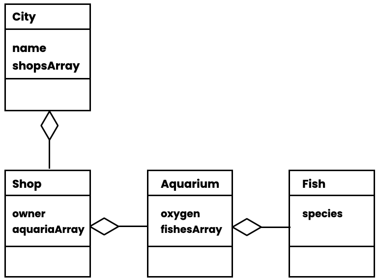

# Les 7 - week 4 ochtend

## Composition Javascript

- Bouw dit klassendiagram in vanilla javascript (geen excalibur).
- Let op dat je arrays gebruikt.
- Geef de vis een `console.log("blub")` opdracht om te zien hoeveel vissen er in je stad zijn.

 
 
 

## Composition Excalibur

- Bouw dit klassendiagram in excalibur.
- De afbeeldingen staan in de [images folder](../images/).
- Laat meerdere bomen langzaam naar links bewegen.
- Laat per boom meerdere kippen heen en weer lopen. Blijven de kippen op de boomstam?

### Resultaat

 
 
 