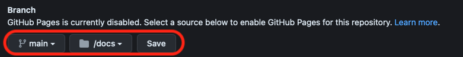

# Werken met Excalibur

- Startcode downloaden
- Project installeren en development server starten
- Wijzigingen naar github pushen
- Github pages gebruiken

<br>
<br>
<br>

## Startcode downloaden

- Ga naar het [Excalibur Startproject](https://github.com/HR-CMGT/prg4-startproject-2023) of het [Javascript Startproject](https://github.com/HR-CMGT/prg4-javascript-2023)
- Klik op ***USE THIS TEMPLATE***. Kies als owner jouw eigen github account. 
- Geef je repository een goede naam. Check dat het startproject in je eigen github terecht komt.
- CLONE de repository van jouw eigen github naar je lokale computer via de git url. Die vind je onder "code".
- Open VS Code. Klik het "Source Control" icoontje. Kies voor "clone repository" en plak de git url.
- VS Code haalt nu het startproject op en opent het automatisch.

[🔥 Bekijk dit instructie filmpje](https://youtu.be/UIVpe4L5_P4)

<br>
<br>
<br>

## Project installeren en development server starten

- Open een terminal in VS Code. Daar typ je:

```bash
npm install
npm run dev
```

Open de browser op de link die verschijnt. Je kan nu je game gaan ontwikkelen. Om te stoppen typ je `ctrl + c` in de terminal.

<br>
<br>
<br>

## Code opslaan op Github

Klik op Source Control in VS Code. Typ een commit message en klik op commit, en vervolgens `sync` (of `push`). Je code staat nu op je eigen github.

<br>
<br>
<br>

## Publiceren op Github Pages

In de ***github pages settings*** kies je voor ***publish main > docs***. Dit zorgt dat je `docs` folder live komt te staan.



Je publiceert je project in de `docs` folder met het `npm build` commando. Pas je `package.json` aan met de `projectnaam` van jouw project:

```json
"scripts": {
  "build": "vite build --outDir=docs --base=/projectnaam/",
},
```
> *Voorbeeld: als je project gaat draaien op `https://jouwnaam.github.io/chicken-on-a-raft/`, dan vul je `--base=/chicken-on-a-raft/` in 🐔*

