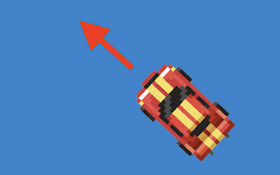

# Code Snippets

- [Scrolling Background](./scrolling.md)
- Loading Screen aanpassen
- [Spritesheet](./spritesheet.md)
- Click en Exit Screen Events
- Keyboard besturing
- Sturen en draaien
- [Tekstveld met score tonen](./tekstveld.md)
- Scenes
- JSON laden
- Sprites wisselen binnen een actor
- Custom Events
- Flip sprite
- Health Bar
- Object spawner with delay (Timer)

<br><br><br>

## Loading Screen aanpassen

RESOURCES.JS
```javascript
import titleImage from '../images/loadingscreen.png'

const ResourceLoader = new Loader([Resources.Fish, Resources.Mario])
ResourceLoader.logo = titleImage
ResourceLoader.logoWidth = 659
ResourceLoader.logoHeight = 203
ResourceLoader.backgroundColor = Color.White
ResourceLoader.loadingBarColor = Color.Black
```
Je moet de startbutton aanpassen via CSS, omdat dit geen canvas button is.
```css
#excalibur-play {
    background: rgb(0, 0, 0) !important;
}
```

<br><br><br>

## Click en Exit Screen Events

On Exit Screen
```javascript
class Fish extends Actor {
    onInitialize(engine) { 
        this.enableCapturePointer = true
        this.pointer.useGraphicsBounds = true
        this.on("exitviewport", (event) => this.resetPosition())
        this.on("pointerup", (event) => this.resetPosition())
    }
    resetPosition(){
        this.pos = new Vector(1000,10)      // verplaatsen
        this.kill()                         // verwijderen
    }
}
```
<br><br><br>

## Keyboard besturing

In dit voorbeeld kijken we in de `update` loop welke toetsen zijn ingedrukt. Aan de hand daarvan veranderen we de `velocity` van de speler.

```javascript
class Shark extends Actor {

    onPreUpdate(engine) {

        let xspeed = 0
        let yspeed = 0

        let kb = engine.input.keyboard

        if (kb.isHeld(Input.Keys.W) || kb.isHeld(Input.Keys.Up)) {
            yspeed = -300
        }
        if (kb.isHeld(Input.Keys.S) || kb.isHeld(Input.Keys.Down)) {
            yspeed = 300
        }
        if (kb.isHeld(Input.Keys.A) || kb.isHeld(Input.Keys.Left)) {
            xspeed = -300
        }
        if (kb.isHeld(Input.Keys.D) || kb.isHeld(Input.Keys.Right)) {
            xspeed = 300
        }

        this.vel = new Vector(xspeed, yspeed)
    }
}
```

<br><br><Br>

## Sturen en draaien



In plaats van in vier richtingen te bewegen met W A S D kan je ook in de richting bewegen waar je naartoe gedraaid staat. Je kan dan de `rotation` omrekenen naar de `velocity`.

```javascript
let speed = 100
this.vel = new Vector(
    Math.cos(this.rotation) * speed,
    Math.sin(this.rotation) * speed
)
```
- [Compleet voorbeeld](./movedirection.md)
- [Codesandbox voorbeeld](https://codesandbox.io/p/sandbox/excalibur-move-direction-yr22q8)

<br><br><br>


## Scenes

GAME has SCENES
```javascript
import { Level1 } from './scenes/level1'
import { GameOver } from './scenes/gameover'

class Game extends Engine {

    everythingLoaded() {
        this.add('level1', new Level1())
        this.add('gameover', new GameOver())

        this.goToScene('level1')
    }
}
```
Je bouwt nu je levels in een SCENE in plaats van rechtstreeks in de game.

Een scene heeft een `onActivate` functie, deze wordt elke keer aangeroepen dat de scene actief wordt.

Gebruik de `engine` variabele om van scene te wisselen. Omdat je die variabele niet altijd beschikbaar hebt maak je er een property van.

```javascript
import { Scene } from "excalibur"

export class Help extends Scene {

    game

    onInitialize(engine) {
        this.game = engine
    }

    onActivate(ctx) {
        console.log("the scene has started!")
    }

    gameOver() {
        this.game.goToScene('gameover')
    }
}
```
<br>

### Waarden doorgeven aan een scene

Het is mogelijk om waarden zoals een score van de ene scene naar de andere door te geven via de `onActivate` functie.

```javascript
this.game.goToScene('gameover', { level: 4, score: 12 })
```
Dit kan je dan als volgt uitlezen:
```javascript
onActivate(ctx) {
    if(ctx.data) {
        console.log(`LEVEL: ${ctx.data.level}`)
        console.log(`SCORE: ${ctx.data.score}`)
    }
}
```


<br><br><br>


## JSON laden

Als je `import` gebruikt wordt het JSON bestand onderdeel van je project tijdens de `build` stap. Je hoeft het niet toe te voegen aan de excalibur loader. Als de data van een externe server komt (of als het bestand heel groot is) is het beter om `fetch` te gebruiken.

VOORBEELD

```javascript
import jsonData from "../data/pokemon.json"

class Pokemon extends Actor {
    showPokemon(){
        for(let p of jsonData) {
            console.log(p)
        }
    }
}
```
<br><br><br>


## Sprites wisselen binnen een actor

Je kan meerdere sprites in een graphic zetten met `add`. Je kan deze sprites tonen en verbergen met `show` en `hide`.
Of, je kan via `use` aangeven welke sprite op een bepaald moment getoond moet worden.

```javascript
export class Mario extends Actor {

    onInitialize(engine) {
        this.graphics.add('walk', Resources.Walk.toSprite())
        this.graphics.add('jump', Resources.Jump.toSprite())
    }

    walk() {
        this.graphics.show('walk') 
        this.graphics.hide('jump') 
        
        // of
        this.graphics.use('walk')
    }

    jump() {
        this.graphics.show('jump') 
        this.graphics.hide('walk') 
        
        // of
        this.graphics.use('jump')
    }
}
```


<br><br><br>


## Custom Events

Een child kan een event afvuren met `emit`. De parent kan hier naar luisteren met `on`.

PARENT listens to BLUB event
```javascript
class Aquarium extends Actor {
    onInitialize() {
        let fish = new Fish()
        this.add(fish)
        
        fish.on("blub", (event) => {
            console.log("fish says blub")
        })
    }
}
```
CHILD emits BLUB event
```javascript
import { GameEvent } from "excalibur"

class Fish extends Actor {
    onCollision() {
        this.emit('blub', new GameEvent())
    }
}
```


<br><br><br>

## Flip sprite

MARIO.JS
```javascript
import { Actor, Engine, Vector } from "excalibur"
import { Resources, ResourceLoader } from './resources.js'

export class Sprite extends Actor {

    onInitialize(engine) {
        // optie 1: flip de sprite bitmap
        this.sprite = Resources.Mario.toSprite()
        this.graphics.use(this.sprite)
        this.sprite.flipHorizontal = true

        // optie 2: flip de hele actor
        // het kan dan nodig zijn om de anchor te verplaatsen
        this.scale = new Vector(-1, 1);
        this.anchor = new Vector(1, 0);
    }
}
```
Flip spritesheet

```javascript
let left = Animation.fromSpriteSheet(spriteSheetRun, range(1, 10), 50)
let right = left.clone()
right.flipHorizontal = true
```

<br><br><br>

## Health Bar

Hieronder zie je een actor class die met behulp van `Rectangle` een health bar tekent. Je kan de health bar aanmaken met `new HealthBar()`

```javascript
import { Actor, Vector, Color, Sprite, Rectangle, clamp } from 'excalibur'

export class HealthBar extends Actor {

    healthrectangle

    constructor() {
        super({ width: 165, height: 30 })
        this.healthrectangle = new Rectangle({
            width: 165,
            height: 30,
            color: Color.Red,
        })
        this.anchor = new Vector(0, 0)
        this.graphics.use(this.healthrectangle)
    }

    resetHealth(){
        this.timerectangle.width = 165
    } 

    loseHealth(damage) {
        this.healthrectangle.width = this.healthrectangle.width - damage
        
        if (this.healthrectangle.width <= 0) {
            console.log("game over")
        }
    }
}
```

<br><br><br>
    
 ## Object Spawner with delay (Timer)
    
```
import {Actor, Random, Timer} from "excalibur";
import {Rock} from "./rock.js";

export class Spawner extends Actor{

    gameElements = []
    constructor() {
        super();

        this.random = new Random(1337)

    }

    onInitialize(engine) {
        this.timer = new Timer({
            fcn: () => this.spawn(engine),
            interval: 1000,
            repeats: true
        })
        engine.currentScene.add(this.timer)
        this.timer.start()
    }

    spawn(engine) {
        console.log("spawn")
        const rock = new Rock(
            this.random.integer(0, 800),
            this.random.integer(0, 600)
        )
        this.gameElements.push(rock)
        engine.currentScene.add(rock)
    }
}
```
    
 
