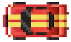

# Een auto besturen


Als je een auto bestuurt gebruik je `A`, `D` of ⬅️ ➡️ om de auto te draaien (`rotation`). Met de `W` of ⬆️ toets beweeg je in de richting waarin je gedraaid staat. Dit doe je door de `rotation` van de auto om te rekenen naar een `x,y` velocity.




```javascript
import { Actor, Vector, Input } from "excalibur";
import { Resources } from "./resources.js";

export class Car extends Actor {
  onInitialize(engine) {
    this.graphics.use(Resources.Car.toSprite());
    this.pos = new Vector(400, 400);
  }

  onPreUpdate(engine) {
    let speed = 0;
    if (engine.input.keyboard.isHeld(Keys.Up)) {
        speed = 250;
    }
    if (engine.input.keyboard.isHeld(Keys.Right)) {
        this.rotation += 0.05;
    }
    if (engine.input.keyboard.isHeld(Keys.Left)) {
        this.rotation -= 0.05;
    }
    this.vel = Vector.fromAngle(this.rotation).scale(speed)
  }
}
```
<br>

- [Zie ook werken met Vectoren](./vector.md)
- [Compleet voorbeeld](./movedirection.md)
- [Codesandbox voorbeeld](https://codesandbox.io/p/sandbox/excalibur-move-direction-yr22q8)

